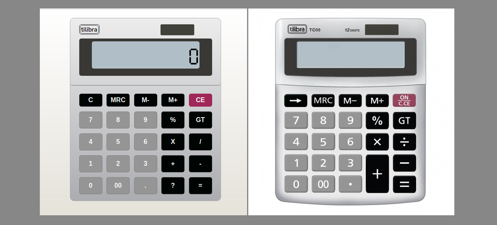

<h1 align="center">Calculadora CSS</h1>

### 💻 Sobre o projeto

- Calculadora CSS - é um projeto desenvolvido para praticar o básico das tecnologias HTML, CSS e JAVASCRIPT.

- Feito com inspiração em um modelo real de uma calculadora, e se adaptando às necessidades do projeto.

### 🎨 Layout

- O layout da aplicação logo a baixo em comparação com o modelo que serviu de inspiração para o projeto.

  

### 🛠 Tecnologias

- As seguintes ferramentas foram usadas na construção do projeto:

- HTML
- CSS
- JAVASCRIPT 🚧 Em construção... 🚧

### 📝 Licença

- Fique a vontade para contribuir...

- Feito com ❤️ por Irani Junior 👋🏽